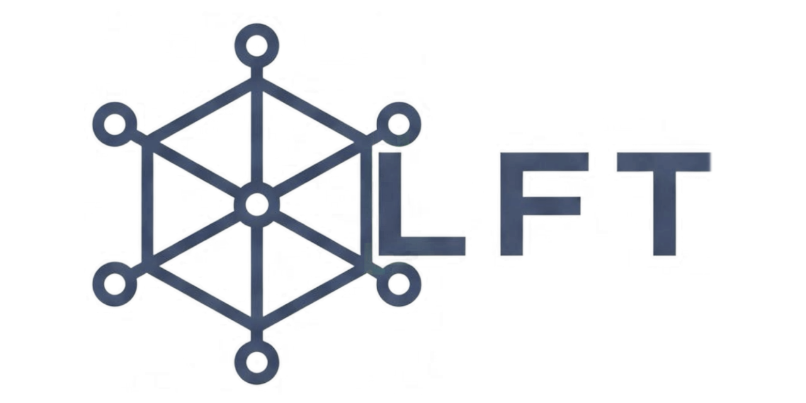

<p align="center"></p>

# Lightweight Fog Testbed (LFT)

[](LICENSE)
[](https://www.python.org/)
[](https://github.com/UnB-COMNET/lft/wiki)

## Description
LFT is a high-performance Python framework designed to orchestrate lightweight, containerized network emulation topologies with ease. Using Docker containers and Linux network namespaces, it allows researchers and engineers to construct arbitrary network topologies, emulate switches (Open vSwitch), SDN controllers (Ryu), cellular links (srsRAN 4G/LTE), and security attack scenarios with CICFlowMeter and perfSONAR integration.

## 1. Requirements
- **Operating System**: Ubuntu Desktop / Server 24.04 LTS (recommended) or macOS via OrbStack/Docker.
- **Kernel**: Linux 5.15+ with network namespaces, `veth`, and Open vSwitch support.
- **Python**: Python 3.9+ with `pip`.
- **Docker**: Docker Engine 24.0+.

## 2. Installation
Install the project via `pip3`:
```bash
pip3 install profissa_lft
```

Or install from source:
```bash
git clone https://github.com/UnB-COMNET/lft.git
cd lft
chmod +x dependencies.sh
./dependencies.sh
pip3 install -e .
```

## 3. Quick Start
Run a simple Software-Defined Network topology:
```bash
cd examples
python3 simpleSDNTopology.py
```

## 4. Troubleshooting
If you encounter any issues:
1. Verify system dependencies: `./dependencies.sh`.
2. Check if lingering containers are active: `docker ps -a` (run `docker rm -f $(docker ps -aq)` to clean up).
3. Ensure required Docker images are available locally: `docker images`.
4. Consult the [Troubleshooting Guide](https://github.com/UnB-COMNET/lft/wiki/Troubleshooting) or [`docs/Troubleshooting.md`](docs/Troubleshooting.md).

## 5. Documentation
Complete, in-depth documentation is available across multiple formats:

- **Interactive GitHub Wiki**: **[UnB-COMNET/lft Wiki](https://github.com/UnB-COMNET/lft/wiki)** (with sidebar navigation, diagrams, and quick references).
- **Markdown Documentation**: Offline-browsable Markdown files in the [`docs/`](docs/) directory.
- **Native DokuWiki Syntax**: Pre-formatted `.txt` files in [`dokuwiki/`](dokuwiki/) ready to import into local lab or university DokuWiki servers.

### Documentation Index
- **[Installation & Requirements](docs/Installation.md)**
- **[LFT Core Architecture](docs/Architecture.md)**
- **[Full API Reference](docs/API-Reference.md)**
- **[SDN Topologies](docs/SDN-Topologies.md)**
- **[Code Examples Walkthrough](docs/Code-Examples.md)** (covers all 8 scripts in `examples/`)
- **[Experiments & Benchmarks](docs/Experiments-and-Benchmarks.md)** (deployment time, scalability, perfSONAR, wired and wireless benchmarks in `experiment/`)
- **[Security Scenario: UNBCA / CIDDS](docs/Security-Scenario-UNBCA.md)** (enterprise topology, benign behaviors, attacks, and flow datasets in `scenario/`)
- **[4G/LTE Cellular Emulation](docs/Wireless-4G-Emulation.md)** (srsRAN EPC, eNodeB, UEs, and ZMQ virtual radio)
- **[Docker Image Catalog](docs/Docker-Images.md)** (specifications for all 11 Docker images)
- **[Troubleshooting & Teardown](docs/Troubleshooting.md)**
- **[Complete Master Manual (All-in-One)](docs/Master-Manual.md)** &bull; [`dokuwiki/LFT_MASTER_MANUAL.txt`](dokuwiki/LFT_MASTER_MANUAL.txt)
